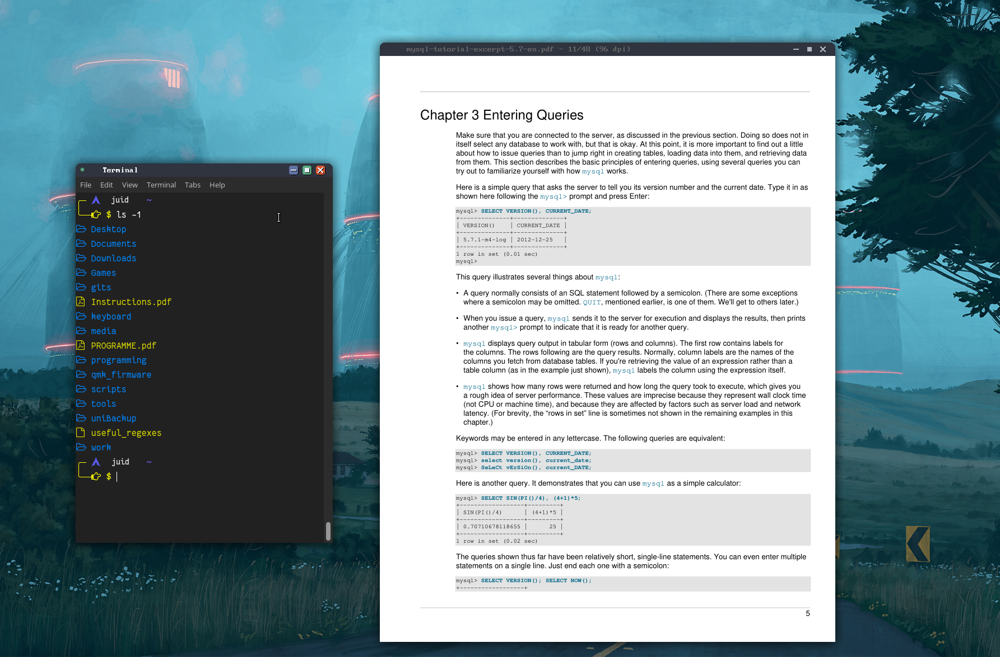
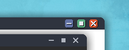

# squared-circle
Minimal but colorful theme for XFWM

Tired of the same old MacOS derivative buttons on GTK? 

Tired of the overly flashy headache inducing lightshow colors just to close some windows?

Then this theme is for you! (probably)

This is how it looks like:





It also has subtle details when hovering over the buttons, like this:


Or when the video grabs focus, no need for huge flashing titlebars:


# Install Instructions

1. Clone this repo

```
git clone https://github.com/jiud/squared-circle.git
```

2. Change directory into the repo folder 

```
cd squeared-circle
```

3. Copy the SquearedCircle folder under ~/.themes/ 

If this folder does not exist, create it.
```
mkdir ~/.themes/
```
Copy the theme folder into the .theme folder
```
cp -r SquearedCircle ~/.themes/
```

#

Go to "Window Manager" (under "Settings Manager") and find the "SquearedCircle" entry. 

Activate the theme, enjoy!
